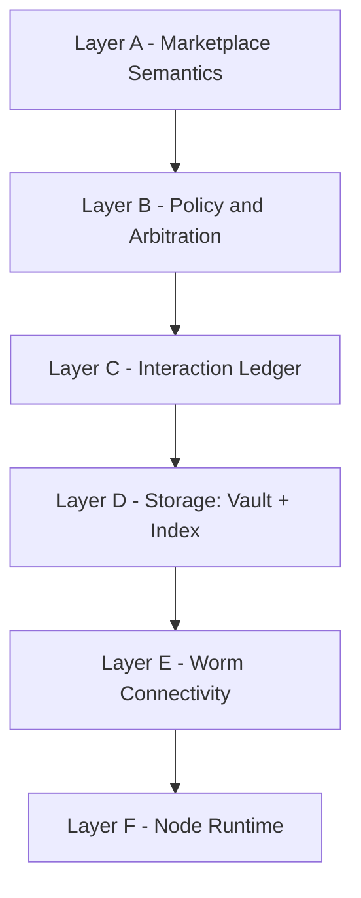

Status: Draft
Invariants:
- Слои A..F описывают только архитектуру - без реализации.
- Worm выделен как отдельный слой связи.

# Architecture Overview

Архитектура описана слоями A..F. Слои связаны через контракты данных - без прямой зависимости реализации.

## Слои A..F
- Layer A - Marketplace Semantics: Lumen, Pact, Aegis, Trace.
- Layer B - Policy and Arbitration: Guardian, Arbiter, Brand.
- Layer C - Interaction Ledger: Event Registry.
- Layer D - Storage: Vault и Index узлы.
- Layer E - Connectivity: Worm, ANS, маршрутизация.
- Layer F - Node Runtime: Nest, Relay, Oracle, Specter.

## Границы
- Слой A не знает о Worm - только о событиях.
- Слой D хранит артефакты - без бизнес-логики.
