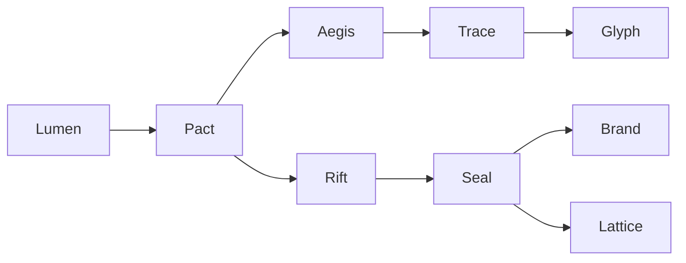

Status: Draft
Invariants:
- Список ключевых сущностей фиксирован.
- Коммуникация разрешена только в рамках Pact.

# Marketplace Event Spec

Version: 0.1.0

События рынка фиксируются в Interaction Ledger. Каждый тип имеет строгие поля и правила валидации.

## Общие поля

| Поле | Тип | Описание |
| --- | --- | --- |
| event_id | CID | Идентификатор события. |
| pact_id | CID | Идентификатор сделки - если применимо. |
| actor_id | string | Участник события. |
| timestamp | int64 | Время события. |

## Lumen
Листинг - предложение товара или услуги.

| Поле | Тип | Описание |
| --- | --- | --- |
| lumen_id | CID | Идентификатор листинга. |
| tier | string | Tier0..Tier2. |
| stake | int64 | Залог для публикации. |
| metadata_cid | CID | Оффчейн описание. |

## Pact
Контракт намерения - клетка сделки.

| Поле | Тип | Описание |
| --- | --- | --- |
| pact_id | CID | Идентификатор сделки. |
| buyer_id | string | Покупатель. |
| seller_id | string | Продавец. |
| terms_cid | CID | Условия сделки. |

## Aegis
Эскроу.

| Поле | Тип | Описание |
| --- | --- | --- |
| aegis_id | CID | Идентификатор эскроу. |
| amount | int64 | Сумма. |
| release_rules | string | Правила разблокировки. |

## Trace
Акт исполнения или подтверждение.

| Поле | Тип | Описание |
| --- | --- | --- |
| trace_id | CID | Идентификатор акта. |
| evidence_cid | CID | Доказательства исполнения. |

## Glyph
Отзыв по сделке.

| Поле | Тип | Описание |
| --- | --- | --- |
| glyph_id | CID | Идентификатор отзыва. |
| rating | int | Оценка. |
| stake | int64 | Залог для отзыва. |

## Rift
Спор.

| Поле | Тип | Описание |
| --- | --- | --- |
| rift_id | CID | Идентификатор спора. |
| claim_cid | CID | Описание претензии. |

## Seal
Вердикт арбитража.

| Поле | Тип | Описание |
| --- | --- | --- |
| seal_id | CID | Идентификатор вердикта. |
| decision | string | Решение арбитра. |
| sanctions | list | Санкции - опционально. |

## Brand
Санкции.

| Поле | Тип | Описание |
| --- | --- | --- |
| brand_id | CID | Идентификатор санкции. |
| level | string | Тип санкции. |
| scope | string | Область действия. |

## Lattice
Апелляция.

| Поле | Тип | Описание |
| --- | --- | --- |
| lattice_id | CID | Идентификатор апелляции. |
| target_seal | CID | Вердикт для апелляции. |
| grounds_cid | CID | Основания. |

## Поток данных сделки

