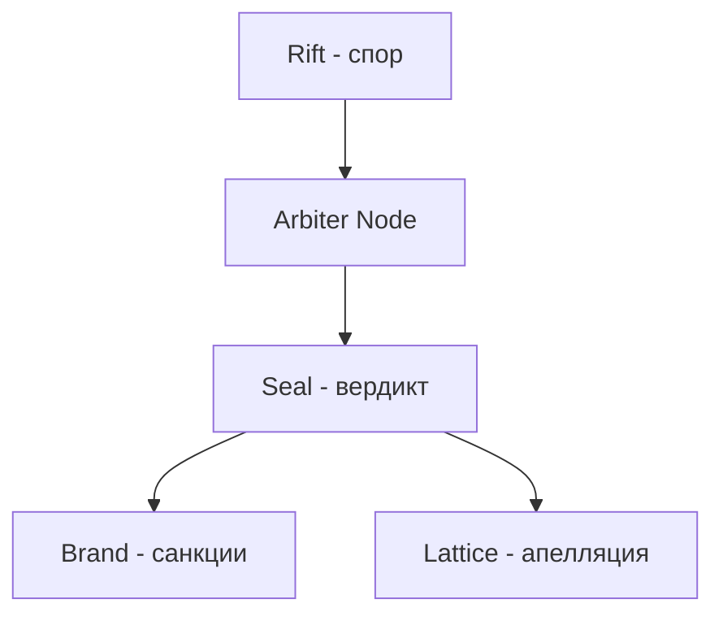

Status: Draft
Invariants:
- Tier2 запрещен и блокируется политикой.
- Политика не отменяет клетку сделки.

# Policy Tier Rules

Version: 0.1.0

Товары и действия стратифицируются по риску. Guardian домены определяют конкретные списки и санкции.

## Tier определения
- Tier0 - низкий риск, базовые товары и услуги.
- Tier1 - средний риск, требуется усиленный мониторинг.
- Tier2 - высокоопасное или незаконное - блокируется.

## Базовые правила
- Публикация листинга требует залога.
- Отзывы требуют залога.
- Tier2 блокируется до создания сделки.

## Контур арбитража

