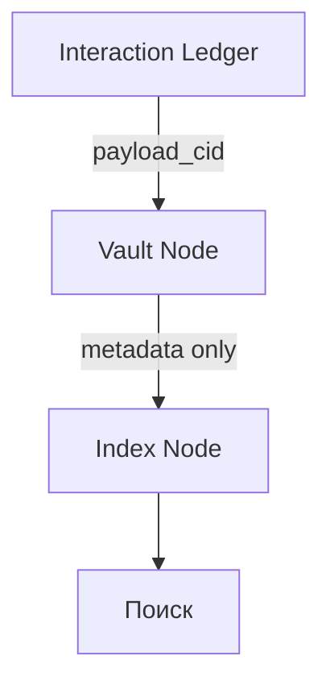

Status: Draft
Invariants:
- Хранение артефактов оффчейн - только CID в Ledger.
- TTL обязателен для всех вложений.

# Storage Spec

Version: 0.1.0

Хранилище использует контентную адресацию и шифрование. Доступ регулируется политикой домена.

## Артефакт

| Поле | Тип | Описание |
| --- | --- | --- |
| cid | CID | Контентный хеш. |
| enc_scheme | string | Схема шифрования. |
| ttl | int64 | Время жизни в секундах. |
| access_policy | string | Правила доступа. |

## Роли
- Vault Node хранит артефакты - соблюдает TTL.
- Index Node хранит индекс - только разрешенные метаданные.

## Место Vault и Index

