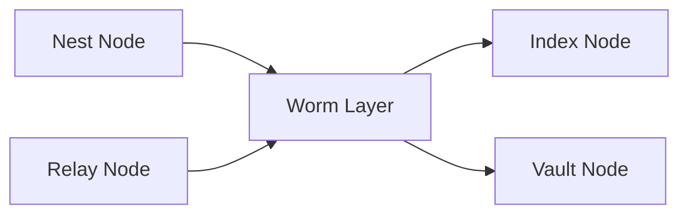

Status: Draft
Invariants:
- Worm не несет бизнес-логики - только связь и именование.
- Поддержка деградации интернета обязательна.

# Worm Field Spec

Version: 0.1.0

Worm - слой связи между узлами. Он использует каналы TCP/IP, TOR, DHT, Wi-Fi Direct, WebRTC, Ad-hoc, LoRa, Sneakernet. Система имен ANS преобразует имена узлов в адреса.

## Базовые сообщения

| Сообщение | Поля | Назначение |
| --- | --- | --- |
| NodeAnnounce | node_id, addrs, caps, ts | Объявление узла. |
| NameResolve | ans_name, ttl | Запрос имени. |
| NameReply | ans_name, addrs, ttl | Ответ по имени. |
| RouteHint | src, dst, cost | Подсказка маршрута. |
| RelayTicket | relay_id, rate, expires | Доступ к Relay узлу. |

## Место Worm

